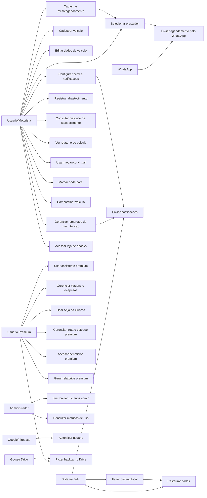

# Diagrama de Casos de Uso - Zellu

Este documento representa, em alto nivel, os principais atores e casos de uso do app Zellu.

## Atores

- **Usuario/Motorista**: pessoa que usa o app para cuidar do veiculo, lembretes, abastecimentos e recursos basicos.
- **Usuario Premium**: usuario com acesso aos recursos avancados, assistente premium, frota/estoque e relatorios premium.
- **Administrador**: pessoa responsavel por acompanhar metricas e dados administrativos.
- **Sistema Zellu**: processos automaticos do app, como notificacoes e backup.
- **Google/Firebase**: servicos externos usados para autenticacao e dados.
- **Google Drive**: servico externo usado para backup/restauracao.
- **WhatsApp**: canal externo usado para enviar agendamentos ou contatos para prestadores.

## Diagrama

## Leitura Rapida

O fluxo principal do usuario gira em torno de cadastrar veiculos, criar lembretes, acompanhar manutencoes, registrar abastecimentos e consultar historicos. O plano premium amplia o app com assistente, viagens, despesas, recursos de seguranca, frota/estoque e relatorios avancados.

Este diagrama complementa o mapa de telas em [`docs/mapa-telas.md`](./mapa-telas.md), que mostra como as telas se conectam dentro do app.
