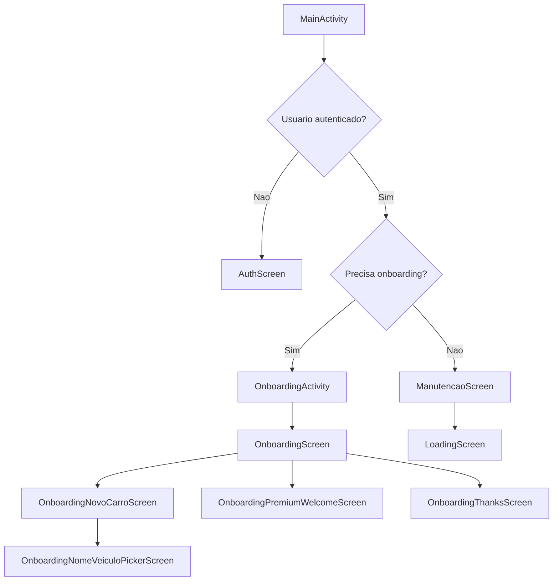
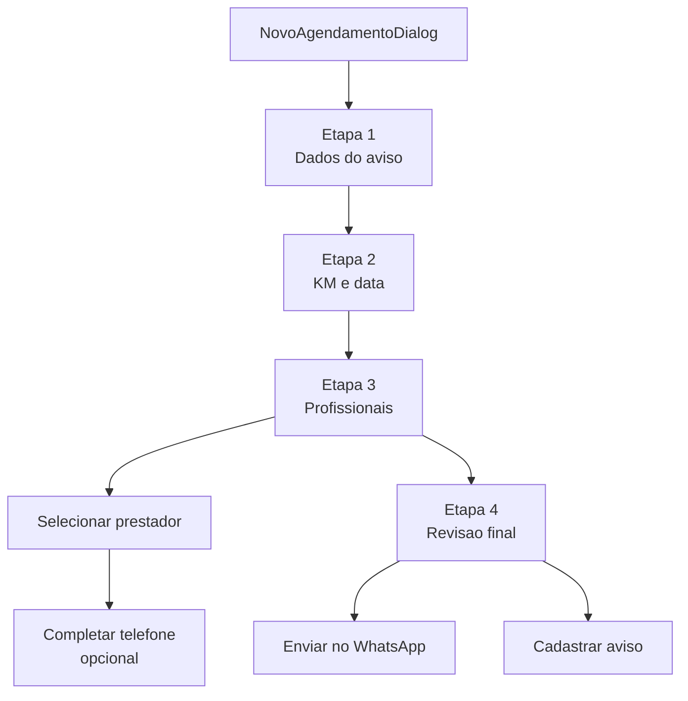
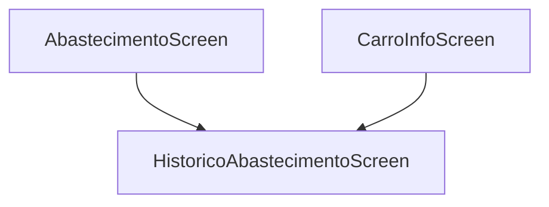

# Mapa Visual Das Telas

Este arquivo mostra, de forma visual, como as telas principais do app se conectam hoje.

Observacoes:
- O projeto mistura telas completas, dialogs e fluxos internos por estado.
- Por isso, este mapa e manual e representa o fluxo principal encontrado no codigo.
- O ponto de entrada principal e `MainActivity`, que entrega o fluxo autenticado para `ManutencaoScreen`.

## Fluxo Principal

## Modulos A Partir Da Tela Principal

```mermaid
flowchart TD
  G[ManutencaoScreen] --> G1[ConfiguracoesScreen]
  G[ManutencaoScreen] --> G2[MecanicoVirtualScreen]
  G[ManutencaoScreen] --> G3[PremiumHubScreen]
  G[ManutencaoScreen] --> G4[GaragemOverviewScreen]
  G[ManutencaoScreen] --> G5[CarroInfoScreen]
  G[ManutencaoScreen] --> G6[PerfilScreen]
  G[ManutencaoScreen] --> G7[AbastecimentoScreen]
  G[ManutencaoScreen] --> G8[HistoricoAbastecimentoScreen]
  G[ManutencaoScreen] --> G9[BikeDistanceScreen]
  G[ManutencaoScreen] --> G10[AondePareiScreen]
  G[ManutencaoScreen] --> G11[AssistentePremiumScreen]
  G[ManutencaoScreen] --> G12[ShareVehicleScreen]
  G[ManutencaoScreen] --> G13[NovoAgendamentoDialog]
```

## Fluxo Do Cadastro De Aviso

## Fluxos Secundarios Encontrados

## Telas Principais Encontradas No Projeto

- `AuthScreen`
- `OnboardingScreen`
- `OnboardingNovoCarroScreen`
- `OnboardingNomeVeiculoPickerScreen`
- `OnboardingPremiumWelcomeScreen`
- `OnboardingThanksScreen`
- `ManutencaoScreen`
- `ConfiguracoesScreen`
- `MecanicoVirtualScreen`
- `PremiumHubScreen`
- `GaragemOverviewScreen`
- `CarroInfoScreen`
- `PerfilScreen`
- `AbastecimentoScreen`
- `HistoricoAbastecimentoScreen`
- `BikeDistanceScreen`
- `AondePareiScreen`
- `AssistentePremiumScreen`
- `ShareVehicleScreen`
- `RelatorioVeiculoScreen`
- `NovoAgendamentoDialog`

## Onde Esse Mapa Veio

Arquivos-base usados para montar o fluxo:
- [MainActivity.kt](C:\Users\PROJETO\Documents\ProjetosGit\Scanner\Projeto_GOL\app\src\main\java\br\com\gui\carlembrete\activities\MainActivity.kt)
- [OnboardingActivity.kt](C:\Users\PROJETO\Documents\ProjetosGit\Scanner\Projeto_GOL\app\src\main\java\br\com\gui\carlembrete\activities\OnboardingActivity.kt)
- [OnboardingScreen.kt](C:\Users\PROJETO\Documents\ProjetosGit\Scanner\Projeto_GOL\app\src\main\java\br\com\gui\carlembrete\screens\OnboardingScreen.kt)
- [ManutencaoScreen.kt](C:\Users\PROJETO\Documents\ProjetosGit\Scanner\Projeto_GOL\app\src\main\java\br\com\gui\carlembrete\screens\ManutencaoScreen.kt)
- [NovoAgendamentoDialog.kt](C:\Users\PROJETO\Documents\ProjetosGit\Scanner\Projeto_GOL\app\src\main\java\br\com\gui\carlembrete\dialogs\NovoAgendamentoDialog.kt)

## Como Ver Visualmente

Voce pode abrir este arquivo:
- no GitHub, que renderiza Mermaid automaticamente
- em editores com suporte a Mermaid
- no Android Studio, em modo preview de Markdown (sem o grafo interativo completo, dependendo da versao)

Se quiser um mapa mais completo, o proximo passo e eu gerar uma versao maior, separando:
- autenticacao
- onboarding
- manutencao
- premium
- dialogs
